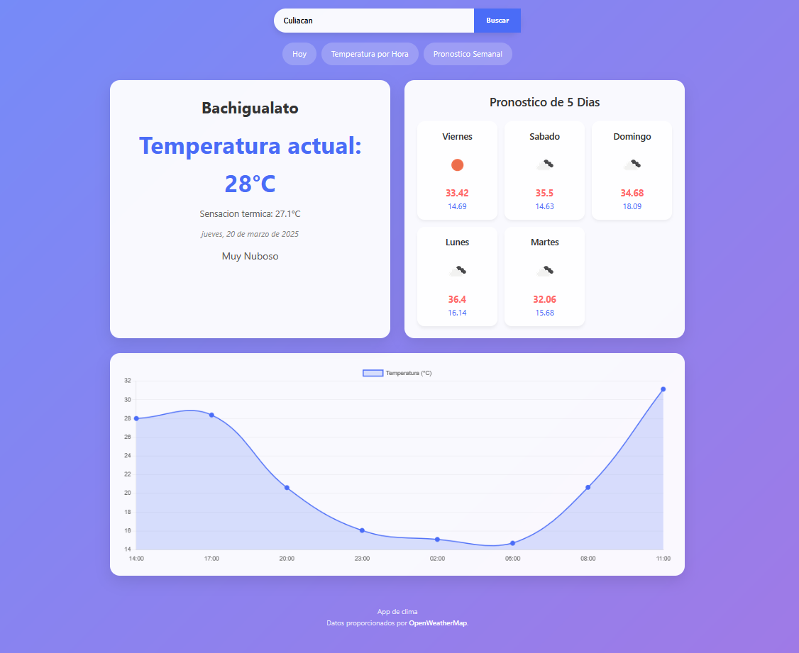

Aplicación de Clima
Descripción
Esta aplicación web permite consultar el clima actual y el pronóstico de los próximos 5 días para cualquier ciudad del mundo. Utiliza la API de OpenWeatherMap para obtener datos meteorológicos en tiempo real.
Características

Visualización del clima actual (temperatura, sensación térmica y descripción)
Pronóstico de 5 días con temperaturas máximas y mínimas
Gráfica de temperatura por hora
Búsqueda de ciudades con autocompletado
Geolocalización para detectar automáticamente la ubicación del usuario
Diseño responsivo para adaptarse a diferentes tamaños de pantalla
Navegación intuitiva entre secciones

Tecnologías utilizadas

-HTML5
-CSS3
-JavaScript (ES6+)
-Chart.js para visualización de datos
-API de OpenWeatherMap
-API de Geolocalización del navegador

Instalación

Clona este repositorio en tu máquina local
Crea un archivo config.js en la raíz del proyecto con el siguiente contenido:
const config = {
API_KEY: "TU_API_KEY_DE_OPENWEATHERMAP"
};

Uso

Al cargar la aplicación, se mostrará el clima de tu ubicación actual (si permites el acceso a la geolocalización)
Puedes buscar cualquier ciudad escribiendo su nombre en el campo de búsqueda
Navega entre las diferentes secciones utilizando los enlaces en la parte superior
Consulta el pronóstico de 5 días y la gráfica de temperatura por hora

Estructura del proyecto

index.html: Estructura principal de la aplicación
css/styles.css: Estilos de la aplicación
js/main.js: Archivo principal de JavaScript
modules/api.js: Módulo para interactuar con la API de OpenWeatherMap
modules/ui.js: Módulo para manipular la interfaz de usuario

Créditos

Este proyecto usa datos obtenidos en [OpenWeatherMap](https://openweathermap.org/).
Iconos de clima de OpenWeatherMap

<a href="https://www.flaticon.com/free-icons/weather" title="weather icons">Weather icons created by iconixar - Flaticon</a>
